# Getting Started: STM32 Amazon Sidewalk MEMS Sensor Demo with /IOTCONNECT

[Purchase the NUCLEO-WBA55CG](https://www.newark.com/stmicroelectronics/nucleo-wba55cg/dev-brd-nucleo-64-32bit-arm-cortex/dp/94AK4277) &nbsp;•&nbsp; [Purchase the NUCLEO-WBA65RI](https://www.newark.com/stmicroelectronics/nucleo-wba65ri/dev-brd-nucleo-64-arm-cortex-m33f/dp/25AM5396) &nbsp;•&nbsp; [Purchase the X-NUCLEO-IKS4A1](https://www.newark.com/stmicroelectronics/x-nucleo-iks4a1/expansion-brd-mems-environmental/dp/04AM0395) &nbsp;•&nbsp; [Purchase the X-NUCLEO-IKS5A1](https://www.newark.com/stmicroelectronics/x-nucleo-iks5a1/expansion-brd-mems-environmental/dp/51AM2356)

> [!NOTE]
> This guide covers both the NUCLEO-WBA55CG and the NUCLEO-WBA65RI; where a value differs between them, the WBA65 value is shown alongside.

| NUCLEO-WBA55CG | NUCLEO-WBA65RI |
|:---:|:---:|
| 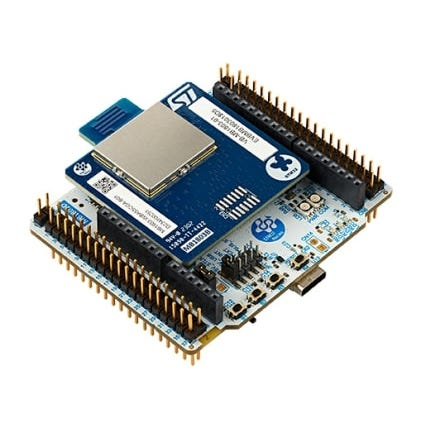 | 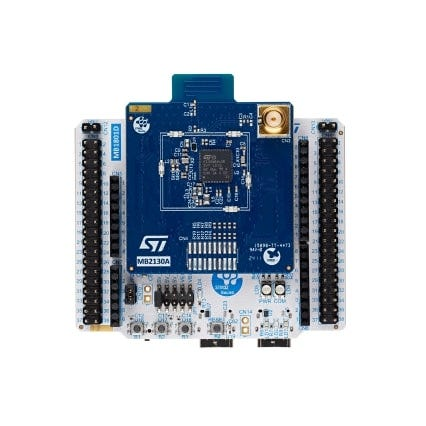 |

## 1. Introduction

This guide walks through bringing a **NUCLEO-WBA55CG** (or **NUCLEO-WBA65RI**) with an **X-NUCLEO-IKS4A1** (or **X-NUCLEO-IKS5A1**) MEMS sensor expansion board online with the Avnet **/IOTCONNECT** platform over **Amazon Sidewalk** (BLE / Link Type 1). When complete, the board streams live accelerometer, gyroscope, temperature, humidity, pressure, orientation, and Qvar (capacitive touch) readings to an /IOTCONNECT dashboard, and you can send commands back to the device.

The firmware is built from source — licensing on the upstream SDK and crypto library prevents this repository from redistributing compiled images (see [`NOTICE.md`](NOTICE.md)). Step 9 covers the build with a one-command helper script; the one-time toolchain setup it needs is in [Build Setup](BUILD_SETUP.md), and the detailed [example README](examples/sidewalk-mems-wba55/README.md) covers the firmware itself.

Because the data travels over Amazon Sidewalk, your device reaches the cloud through any nearby **Sidewalk gateway** (for example, a compatible Amazon Echo) — no local Wi-Fi credentials are programmed onto the board.


_Device onboarding: a per-device certificate is provisioned, then the manufacturing data is flashed onto the board._


_Device connectivity: the board reaches /IOTCONNECT through a nearby Sidewalk gateway and the AWS backend._

> [!NOTE]
> Amazon Sidewalk coverage is required for the device to connect. Make sure a compatible Sidewalk gateway is powered on, within range, and has Amazon Sidewalk enabled. See [Amazon Sidewalk gateway](#amazon-sidewalk-gateway) in Step 2.

---

## Table of Contents

1. [Introduction](#1-introduction)
2. [Prerequisites](#2-prerequisites)
3. [Create /IOTCONNECT Account](#3-create-iotconnect-account)
4. [Import the Device Template](#4-import-the-device-template)
5. [Create a Sidewalk Device](#5-create-a-sidewalk-device)
6. [Obtain the Device Certificate](#6-obtain-the-device-certificate)
7. [Generate the Manufacturing Image](#7-generate-the-manufacturing-image)
8. [Setup Hardware](#8-setup-hardware)
9. [Build and Flash the Firmware](#9-build-and-flash-the-firmware)
10. [Check Connectivity](#10-check-connectivity)
11. [Import the Dashboard](#11-import-the-dashboard)
12. [Send a Command (Downlink)](#12-send-a-command-downlink)
13. [Resources](#13-resources)

---

## 2. Prerequisites

**Hardware**

* [NUCLEO-WBA55CG](https://www.newark.com/stmicroelectronics/nucleo-wba55cg/dev-brd-nucleo-64-32bit-arm-cortex/dp/94AK4277) or [NUCLEO-WBA65RI](https://www.newark.com/stmicroelectronics/nucleo-wba65ri/dev-brd-nucleo-64-arm-cortex-m33f/dp/25AM5396)
* [X-NUCLEO-IKS4A1](https://www.newark.com/stmicroelectronics/x-nucleo-iks4a1/expansion-brd-mems-environmental/dp/04AM0395) or [X-NUCLEO-IKS5A1](https://www.newark.com/stmicroelectronics/x-nucleo-iks5a1/expansion-brd-mems-environmental/dp/51AM2356) MEMS sensor expansion board
* USB Type-C cable
* [Amazon Sidewalk compatible gateway](https://docs.sidewalk.amazon/introduction/sidewalk-gateways.html)

**Software**

* PC running Windows 11 (recommended)
* [STM32CubeProgrammer](https://www.st.com/en/development-tools/stm32cubeprog.html) (provides the `STM32_Programmer_CLI` used for flashing)
* [Python 3.10+](https://www.python.org/downloads/) (used to generate the per-device manufacturing image) — tick **Add python.exe to PATH** in the installer

> [!NOTE]
> **Windows: `Python was not found; run without arguments to install from the Microsoft Store`.** Windows ships placeholder `python.exe` / `python3.exe` shortcuts that are not Python and shadow a real install. Turn them off under **Settings > Apps > Advanced app settings > App execution aliases** (switch off `python.exe` and `python3.exe`), then reopen Git Bash. The provisioning script also detects and skips these stubs on its own.
* A Serial Terminal application such as [Tera Term](https://teratermproject.github.io/index-en.html), [PuTTY](https://www.putty.org/), or `screen` (115200 8N1)
* **Windows only:** [Git for Windows](https://git-scm.com/download/win), which installs **Git Bash**. The provisioning, build, and flash helpers in this repo are bash scripts — run them from a Git Bash prompt. macOS and Linux already have a suitable shell.
* **To build the firmware (Step 9):** STM32CubeIDE plus three ST packages, staged by one script — follow [Build Setup](BUILD_SETUP.md) once before you reach Step 9. Everything up to Step 8 works without it.

### Get this repository

**[Download the repository ZIP](https://github.com/avnet-iotconnect/iotc-stm32-sidewalk/archive/refs/heads/main.zip)**, then extract it anywhere convenient (e.g. `Downloads\iotc-stm32-sidewalk-main`). That is all you need — this is a public repository, so the download works for anyone, with **no GitHub account, no sign-in, and no `git` installation**.

Everything this guide references (templates, decoders, dashboards, and the provisioning script) is inside that ZIP. If you would rather use Git, `git clone https://github.com/avnet-iotconnect/iotc-stm32-sidewalk.git` gets you the same content.

### Amazon Sidewalk gateway

Your board does **not** join your Wi-Fi. It reaches the cloud through a nearby **Amazon Sidewalk gateway**, such as a compatible Amazon Echo or Ring device. This demo uses **Sidewalk over BLE (Link Type 1)**, so the gateway must support BLE.


* **Compatible gateways:** see Amazon's [Sidewalk gateways](https://docs.sidewalk.amazon/introduction/sidewalk-gateways.html) page for the current list.
* **Setup:** make sure **Amazon Sidewalk** and **location services** are enabled for the gateway in the Alexa or Ring app.
* **Availability:** check Amazon's [Sidewalk coverage map](https://coverage.sidewalk.amazon/) for where Sidewalk is currently available.
* **Placement:** keep the gateway powered and within BLE range of your board; the same room is ideal.

Your board does not need to be on the same Amazon account as the gateway.

---

## 3. Create /IOTCONNECT Account

An /IOTCONNECT account with an **AWS backend** is required (Amazon Sidewalk runs on AWS IoT Wireless). If you need an account, a free trial subscription is available, directly from [iotconnect.io](https://iotconnect.io) or through the AWS Marketplace.

* Option #1 **(Recommended)**
  /IOTCONNECT via [AWS Marketplace](https://github.com/avnet-iotconnect/avnet-iotconnect.github.io/blob/main/documentation/iotconnect/subscription/iotconnect_aws_marketplace.md) — 60-day trial; AWS account creation required.

* Option #2
  /IOTCONNECT via [iotconnect.io](https://subscription.iotconnect.io/subscribe?cloud=aws) — 30-day trial; no credit card required.

> [!NOTE]
> Be sure to check any SPAM folder for the temporary password after registering. Amazon Sidewalk **requires the AWS backend**, so make sure your subscription is the AWS variant.

---

## 4. Import the Device Template

The **device template** defines the telemetry attributes and downlink commands for the MEMS demo, and the **decoder** turns the raw Sidewalk uplink into named values.

1. Download the pre-made device template from this repo: [`device-templates/sidewalk_st_WBA+MEMS_template.JSON`](device-templates/sidewalk_st_WBA+MEMS_template.JSON) (template code `STswMEMS`, *“Sidewalk ST WBA + MEMS”*). The same template covers both the IKS4A1 and IKS5A1 boards.
2. Login to the platform at [console.iotconnect.io](https://console.iotconnect.io).
3. From the navigation panel on the left, select the **Devices** icon and choose **Wireless Device** from the sub-menu.<br>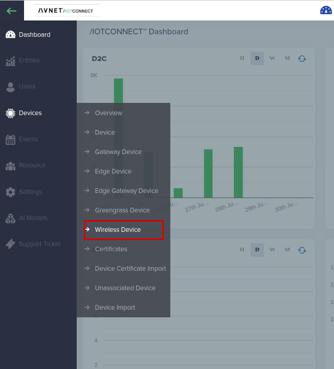
4. At the bottom of the page, select the **Templates** icon from the toolbar.<br>
5. At the top-right of the page, select the **Create Template** button.<br>
6. At the top-right of the page, select the **Import** button.<br>
7. Click **Browse**, navigate to and select the downloaded `sidewalk_st_WBA+MEMS_template.JSON`.
8. Click **Save**.

### Submit the decoder for approval

The decoder for this demo is [`decoders/sidewalk-mems-tlv.py`](decoders/sidewalk-mems-tlv.py), and one decoder serves both sensor boards. A new account has no approved decoder, so submit this one now. How the decoder works, and how to test it locally, is covered in the [Developer Guide](DEVELOPER_GUIDE.md#the-uplink-decoder).

1. From the navigation panel on the left, select the **Settings** icon and choose **Key Vault**.<br>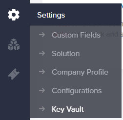
2. Select the **Wireless** tab, then **Custom Decoder**, and click **Create Decoder**.<br>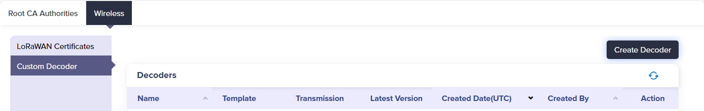
3. Fill in the fields:
   * **Transmission type:** select **Sidewalk**
   * **Template:** select the imported template *Sidewalk ST WBA + MEMS*
   * **Device:** leave empty
   * **Runtime:** select **Python**
   * **Upload File:** click **Browse** and select `decoders/sidewalk-mems-tlv.py`
4. Click **Save**.

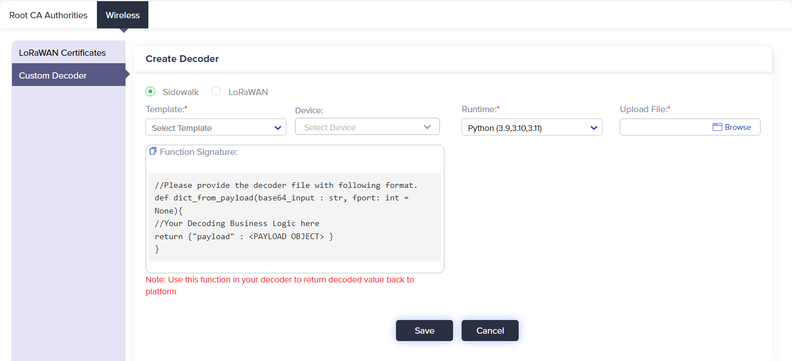

Custom decoders are reviewed by /IOTCONNECT before they can run in the cloud, which typically takes about 24 hours. You will receive an email through the ticket system when your decoder is approved.

---

## 5. Create a Sidewalk Device

In this step you create a **Wireless Device** of transmission type **Sidewalk**, associated with the template you just imported. /IOTCONNECT registers it with AWS IoT Wireless and generates the per-device Sidewalk credentials.

1. From the navigation panel on the left, select the **Devices** icon and choose **Wireless Device** from the sub-menu.<br>
2. At the top-right, click **Create Device**.
3. Fill in the fields:
   * **Transmission Type:** select **Sidewalk**
   * **Unique Id:** a unique identifier for this unit, e.g. `wba-mems-01`. **Pick this carefully — it cannot be changed later**, and you will pass it to the provisioning script in Step 7.
   * **Device Name:** a friendly name, e.g. `WBA MEMS Demo`
   * **Entity:** select the entity to own the device (new accounts have a single option)
   * **Template:** select the imported template *Sidewalk ST WBA + MEMS*
   * **Custom Decoder:** select `sidewalk-mems-tlv` once it has been approved
4. Click **Save & View**. Saving whitelists the device with AWS IoT Wireless for authorization.

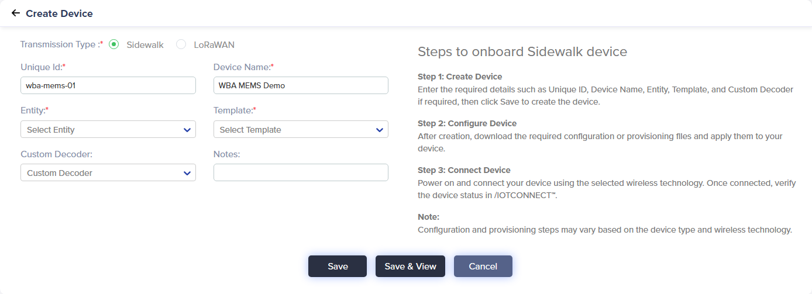

_(Screen: Create Device)_

After saving, the device appears in the Sidewalk device list, ready to be provisioned and flashed.

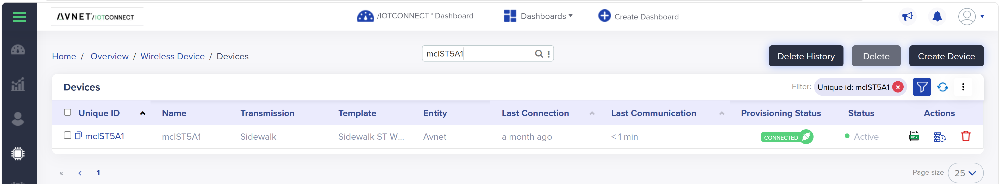

_(Screen: Sidewalk Device List)_

---

## 6. Obtain the Device Certificate

Amazon Sidewalk provisions each device with a unique **certificate JSON** (the Sidewalk manufacturing credentials, sometimes called the *device bundle*). You will convert this into a board-flashable manufacturing image in the next step.

The download is available in two places — either works, and both give you the same file:

**From the device overview page (easiest).** You are already here if you clicked **Save & View** in Step 5. Otherwise open the device from the **Wireless Device** list. The certificate download sits with the device's other actions on this page.

**From the Wireless Device list.** Find your device, look at the **Actions** column on the right, and click the certificate download icon.

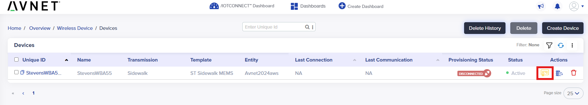

> [!IMPORTANT]
> The certificate JSON contains **device private keys**. Treat it like an SSH key: never commit it, never paste it into chat/email/tickets, and delete it from shared machines after flashing. This repository already `.gitignore`s the `binaries/sidewalk-mfg/` directory where the generated artifacts land.

---

## 7. Generate the Manufacturing Image

The certificate JSON must be converted into a **board-format manufacturing image** (`mfg.bin` / `mfg.hex`) before it can be flashed. A helper script in this repo wraps the SDK's `provision.py` and writes the output to a per-device folder.

### One-time setup: get the STM32-Sidewalk-SDK

The provisioning logic lives in ST's SDK, so you need a copy of it alongside this repository. **[Download the STM32-Sidewalk-SDK ZIP from ST's GitHub repository](https://github.com/stm32-hotspot/STM32-Sidewalk-SDK/archive/refs/heads/main.zip)** (~53 MB, public, no account needed) and extract it **next to** your `iotc-stm32-sidewalk` folder:

```
Downloads/
├── iotc-stm32-sidewalk-main/     <-- this repo
└── STM32-Sidewalk-SDK-main/      <-- the SDK, extracted alongside it
```

If you keep the SDK somewhere else, set the `SDK_ROOT` environment variable to its path:

```bash
SDK_ROOT=/c/path/to/STM32-Sidewalk-SDK ./scripts/provision-device.sh ...
```

> [!NOTE]
> `could not find the STM32-Sidewalk-SDK` means this step was skipped or the folder is somewhere the script does not look — the error lists every path it tried.

The SDK's provisioning tool needs two Python packages:

```
python -m pip install pyyaml intelhex
```

### Run the provisioning script

From the root of the extracted repo folder (a **Git Bash** prompt on Windows):

```bash
./scripts/provision-device.sh <device-name> <path-to-cert.json> [chip]
```

* `<device-name>` — the device's **Unique ID** from Step 5 (e.g. `wba-mems-01`). It names the output folder, so using the Unique ID is what lets you match a generated image back to the device it belongs to. It is *not* read from the certificate, so a typo here silently produces a confusingly-named folder rather than an error.
* `<path-to-cert.json>` — the file you downloaded in Step 6. It is normally called **`certificate.json`**.
* `[chip]` — optional; defaults to **`WBA55xG`** (NUCLEO-WBA55CG). Pass **`WBA65xI`** for the NUCLEO-WBA65RI. The script picks the matching mfg flash address automatically.

For the NUCLEO-WBA55CG:

```bash
./scripts/provision-device.sh wba-mems-01 certificate.json
```

For the NUCLEO-WBA65RI:

```bash
./scripts/provision-device.sh wba-mems-01 certificate.json WBA65xI
```

This produces (WBA55 shown; on WBA65 the `mfg.bin` flashes @ `0x081FE000`):

```
binaries/sidewalk-mfg/wba-mems-01/
├── cert.json
├── mfg.bin      <-- flash this @ 0x080FE000  (WBA65: 0x081FE000)
└── mfg.hex
```

> [!NOTE]
> If you would rather not use a shell at all, `scripts/provision-device.py` takes the same arguments and runs under plain `python` on any platform.

> [!NOTE]
> Do **not** flash the raw certificate JSON, and do not reuse a `mfg.bin` from anywhere else — each image is bound to one device. Always generate it with the provisioning script (which runs `provision.py st aws --chip WBA55xG`, or `--chip WBA65xI` for the WBA65) first.

---

## 8. Setup Hardware

1. **Snap the detachable add-on board out of the MEMS shield.** The X-NUCLEO-IKS4A1 and IKS5A1 each ship as a **single PCB panel**: the Arduino-format sensor shield, plus a small **add-on board** sitting in a cut-out and held there by two thin perforated tabs. Break it out before you stack the shield — the panel will not seat properly on the host board while it is still attached. (On the IKS4A1 this add-on is the **STEVAL-MKE001A**.)

   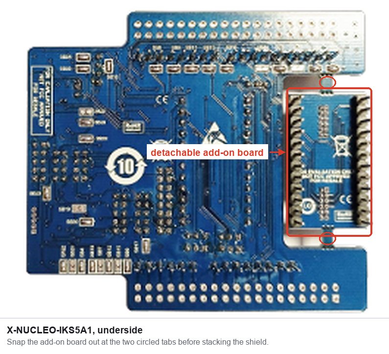

   Support the panel flat with the add-on just past the edge of a table, hold it close to the tabs, and **flex it straight down until the tabs snap** — do not twist, and keep your fingers off the components and pin headers. The tabs are scored to break cleanly by hand; no cutting tool is needed. Keep the add-on board: its pin headers plug into the **DIL24 socket** on the shield when you want to use the sensor it carries.

2. **Stack** the MEMS expansion board onto the NUCLEO-WBA55CG (or NUCLEO-WBA65RI): align the **X-NUCLEO-IKS4A1** (or **IKS5A1**) onto the Arduino headers and press firmly until fully seated. No jumpers or extra wiring are needed — the sensors talk over the Arduino I²C connector.

   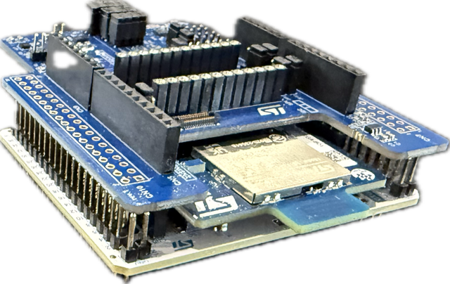

   _The MEMS sensor shield stacked on the NUCLEO-WBA55CG; the NUCLEO-WBA65RI hosts the same shield identically._

3. **Connect** the USB Type-C cable from your PC to the board's ST-LINK port.
4. Confirm the board powers up (the ST-LINK LED illuminates).

---

## 9. Build and Flash the Firmware

You build the firmware yourself; pre-built images are not distributed in this repository (see `NOTICE.md` for the licensing rationale). You then flash **two** images: the firmware and the per-device manufacturing data from Step 7.

### One-time build setup

Complete steps 1 to 3 of [Build Setup](BUILD_SETUP.md) before your first build: install STM32CubeIDE, download the two ST packages, and run the prepare script. A fresh SDK download does **not** build on its own.

### Build the firmware

Select your host board. For the NUCLEO-WBA55CG:

```bash
export BOARD=wba55
```

For the NUCLEO-WBA65RI:

```bash
export BOARD=wba65
```

Then build. One run produces the firmware for both sensor shields:

```bash
./scripts/build-firmware.sh
```

If the build fails, see [If it fails](BUILD_SETUP.md#if-it-fails) in Build Setup.

Output lands at:

```
binaries/sid_ble_wba55_iks4a1.hex     # (WBA65: sid_ble_wba65_iks4a1.hex)
binaries/sid_ble_wba55_iks5a1.hex     # (WBA65: sid_ble_wba65_iks5a1.hex)
```

Pick the one that matches your host board + sensor board:

| Physical board | Firmware hex |
|---|---|
| NUCLEO-WBA55CG + **X-NUCLEO-IKS4A1** | `binaries/sid_ble_wba55_iks4a1.hex` |
| NUCLEO-WBA55CG + **X-NUCLEO-IKS5A1** | `binaries/sid_ble_wba55_iks5a1.hex` |
| NUCLEO-WBA65RI + **X-NUCLEO-IKS4A1** | `binaries/sid_ble_wba65_iks4a1.hex` |
| NUCLEO-WBA65RI + **X-NUCLEO-IKS5A1** | `binaries/sid_ble_wba65_iks5a1.hex` |

### Flash the two images

[`tools/flash_wba.sh`](tools/flash_wba.sh) erases the chip, writes the firmware, then writes the manufacturing image — each step under connect-under-reset with an automatic one-shot retry. It is board-agnostic: pass whichever firmware hex and `mfg.hex` you built.

```bash
tools/flash_wba.sh \
  binaries/sid_ble_wba55_iks4a1.hex \
  binaries/sidewalk-mfg/wba-mems-01/mfg.hex
```

The equivalent three commands, if you would rather run them yourself:

```bash
STM32_Programmer_CLI -c port=SWD mode=UR -e all
STM32_Programmer_CLI -c port=SWD mode=UR -d binaries/sid_ble_wba55_iks4a1.hex -v
STM32_Programmer_CLI -c port=SWD mode=UR -d binaries/sidewalk-mfg/wba-mems-01/mfg.hex -v
```

The `mfg.hex` carries its own flash address. If you flash the raw `mfg.bin` instead, supply the address yourself — `0x080FE000` on WBA55, `0x081FE000` on WBA65.

> [!NOTE]
> STM32CubeProgrammer does not add itself to your `PATH`. The `flash_wba.sh` helper finds the CLI on its own; to run the commands by hand, call it by its full path, e.g. `"/c/Program Files/STMicroelectronics/STM32Cube/STM32CubeProgrammer/bin/STM32_Programmer_CLI.exe"`.

After flashing, **press the black RESET button** (or power-cycle) to start the firmware.

The two failures worth knowing apart:

**`Error: No debug probe detected`** — the programmer cannot see the board's ST-LINK at all. Confirm with:

```bash
STM32_Programmer_CLI -l      # look under "===== STLink Interface ====="
```

If that says `No ST-Link detected!`, work through these in order:

1. **Suspect the USB cable first.** Many USB-C cables are charge-only and carry no data. Swap in a known-good data cable — this is the most common cause, and the board still lights up on a charge-only cable, so power is not proof.
2. **Check the board is powered** — the ST-LINK LED next to the USB connector should be lit.
3. **Use the ST-LINK USB connector**, not any other port on the board.
4. **Install the ST-LINK driver** (Windows). STM32CubeProgrammer bundles it but does not always install it: run `stlink_winusb_install.bat` as Administrator from
   `C:\Program Files\STMicroelectronics\STM32Cube\STM32CubeProgrammer\Drivers\stsw-link009_v3`, then unplug and replug the board.
5. **Update the ST-LINK firmware** if it is still not seen — run `STM32CubeProgrammer` (the GUI), open **Firmware upgrade** under the ST-LINK panel, and apply the update.

**`DEV_CONNECT_ERR`** — the probe *is* detected but the target will not attach. **Hold the black RESET button** on the Nucleo while the command starts. Between Sidewalk BLE advertising windows the WBA55 / WBA65 enters a low-power mode that gates the SWD pads; holding RESET keeps the CPU awake long enough for the programmer to connect.

---

## 10. Check Connectivity

Open the board's USB serial port at **115200 8N1**. On first boot you should see the device validate its manufacturing data, register with Sidewalk, and begin sending uplinks:

```
[INFO]: MFG storage: validation passed
[INFO]: IKS4A1: sensors initialized
[INFO]: Sidewalk demo started
[INFO]: Sidewalk registration status: Not registered  ->  Sidewalk Device Registration done
[INFO]: Established BLE connection ...
[INFO]: IKS4A1 action uplink seq=0 ...
```

> [!NOTE]
> Use the firmware variant that matches your physical board (IKS4A1 firmware on the IKS4A1 board, IKS5A1 firmware on the IKS5A1 board). A mismatch shows up as an IMU `init failed` message in the serial log.

> [!NOTE]
> `Corrupted dir pair at {0x0, 0x1}` on the first boot after flashing is normal: the erase wiped the LittleFS region, and the SDK formats it and continues. It only signals a problem if it appears on every boot.

> [!NOTE]
> First-boot registration and Sidewalk BLE re-acquisition mean the first uplink can take a couple of minutes to appear. The send cadence is roughly one uplink every ~2 minutes — that gap is Sidewalk's BLE window, not a firmware delay.

Back in /IOTCONNECT, find your device in the **Wireless Device** list and open its **Live Data** tab to confirm telemetry is flowing.

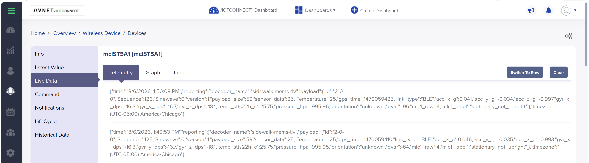

_(Screen: the device's **Live Data → Telemetry** tab — each record is the decoded `sidewalk-mems-tlv` payload: accel/gyro, temperature, pressure, `qvar`, `orientation`, and `mlc1_label`.)_

Sanity-check values for a device sitting on a desk: accel ≈ (0, 0, 1000) mg, gyro ≈ (0, 0, 0) dps, temperature ≈ 22–25 °C, humidity ≈ 30–60 %RH, pressure ≈ 1000–1015 hPa. Touch the silver Qvar pads on the edge of the expansion board to watch the `qvar` field swing.

### If no telemetry appears

The board's serial log tells you which half of the path to look at. If the log shows uplinks going out but Live Data stays empty, the problem is cloud-side — almost always the decoder:

| Symptom | Likely cause | Check / fix |
|---|---|---|
| Device shows **Connected**, Live Data empty | Decoder not attached, or still awaiting approval | Confirm the custom decoder is approved and attached to the `STswMEMS` template (Step 4) |
| Some attributes populate, others stay empty | Decoder output names do not match template attributes | Names are matched **case-sensitively** — compare the decoder's output keys against the template's attribute list |
| Nothing at all, and **Last Communication** never updates | Device is not reaching a gateway | Move the board next to the Sidewalk gateway; confirm Sidewalk is enabled on it (Step 2) |
| Serial log stops at `MFG storage` | Wrong or missing manufacturing image | Re-flash `mfg.hex` for *this* device (Steps 6–7) — an image from another device will not register |
| Serial log shows IMU `init failed` | Firmware/shield mismatch | Flash the hex matching your physical sensor board (IKS4A1 vs IKS5A1) |

### Data sent to the cloud (per board)

Both boards share the same TLV wire format and the single `STswMEMS` template; the IKS5A1 simply leaves a few fields empty. A ✅ means the attribute is populated on every action uplink.

| Cloud attribute | Sensor (IKS4A1 / IKS5A1) | IKS4A1 | IKS5A1 |
|---|---|:--:|:--:|
| `acc_x_g`, `acc_y_g`, `acc_z_g` | LSM6DSV16X / ISM6HG256X (g) | ✅ | ✅ |
| `gyr_x_dps`, `gyr_y_dps`, `gyr_z_dps` | LSM6DSV16X / ISM6HG256X (dps) | ✅ | ✅ |
| `temp_stts22h_c` | STTS22H / ILPS22QS (°C) | ✅ | ✅ |
| `pressure_hpa` | LPS22DF / ILPS22QS (hPa) | ✅ | ✅ |
| `qvar` | LIS2DUXS12 / IIS2DULPX (raw count) | ✅ | ✅ |
| `temp_sht40_c` | SHT40AD1B (°C) | ✅ | — |
| `humidity_sht40_pct` | SHT40AD1B (%RH) | ✅ | — |
| `orientation` | LSM6DSV16X 6D engine | ✅ | — |
| `mlc1_label` (+ `mlc1_raw`, `mlc1_model_id`, `mlc1_model_name`) | LSM6DSV16X / ISM6HG256X MLC (asset_tracking) | ✅ | ✅ |
| `sensor_data` / `Temperature` | whole-°C temperature (for the standard widget) | ✅ | ✅ |
| `Sequence`, `gps_time`, `link_type`, `version` | firmware / Sidewalk metadata | ✅ | ✅ |

> The IKS5A1 omits SHT40 temperature/humidity and 6D orientation (reported as `unknown` — its 6D path is not yet wired in firmware). It **does** run the ISM6HG256X **MLC asset-tracking** classifier, emitting the same `mlc1_label` classes and model id as the IKS4A1, so the shared decoder handles both boards unchanged.

---

## 11. Import the Dashboard

/IOTCONNECT dashboards visualize your device's telemetry with charts, gauges, and widgets. This repo includes a ready-made dashboard **per sensor board**, each showing only the sensors that board actually reports (see the table in Step 10):

| Your shield | Dashboard export | Widgets |
|---|---|---|
| **X-NUCLEO-IKS4A1** | [`sidewalk_st_WBA+IKS4A1_dashboard_export.json`](dashboard-templates/sidewalk_st_WBA+IKS4A1_dashboard_export.json) | Accel / gyro / QVAR charts, 6D orientation and MLC activity pictures, SHT40 + STTS22H temperature, pressure, and humidity gauges |
| **X-NUCLEO-IKS5A1** | [`sidewalk_st_WBA+IKS5A1_dashboard_export.json`](dashboard-templates/sidewalk_st_WBA+IKS5A1_dashboard_export.json) | Accel / gyro / QVAR charts, MLC activity picture, temperature and pressure gauges — no SHT40 or orientation widgets, since the IKS5A1 has neither |

1. Download the export for **your** board from the table above.
2. In /IOTCONNECT, open the **Dashboards** menu at the top of the page and choose **Create Dashboard**.
3. Choose **Import**, then **Browse** to the downloaded export.
4. When prompted, bind the widgets to your device — select the template `STswMEMS` and your device's **Unique ID** — then give the dashboard a name and **Save**.

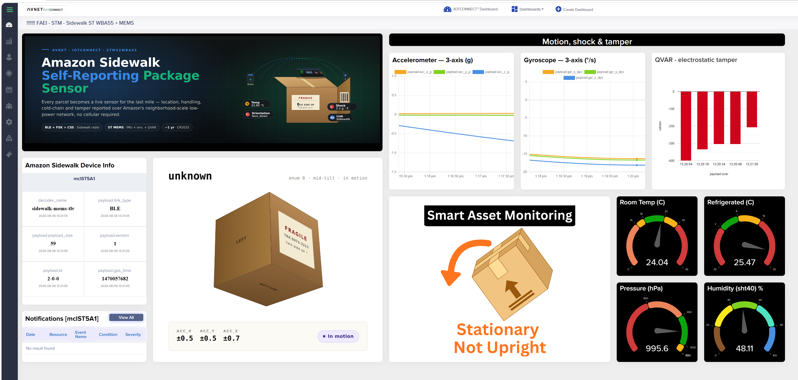

_(Screen: the IKS4A1 dashboard populated with live telemetry — motion / shock / tamper charts, orientation and activity pictures, and environmental gauges. The IKS5A1 dashboard is a tighter layout without the SHT40 and orientation widgets.)_

> [!NOTE]
> Both dashboards bind to the `STswMEMS` template attributes, so import the template (Step 4) and confirm telemetry is flowing (Step 10) first. If you import the IKS4A1 dashboard for an IKS5A1 board it still works — the SHT40 gauges and orientation picture simply stay empty.

---

## 12. Send a Command (Downlink)

The template ships with three downlink commands that travel from the cloud back to the device over Sidewalk:

| Command | Effect |
|---|---|
| **LED_ON** | Turn the user LED on |
| **LED_OFF** | Turn the user LED off |
| **SET_INTERVAL** | Change the uplink period (seconds, clamped to 60–3600) |

Open the device's **Command** tab, choose a command (supply the interval value for `SET_INTERVAL`), and send it. The device logs the received opcode on its serial console (`CMD led_on`, `CMD set_interval -> 300 s`).


_(Screen: Command)_

> [!NOTE]
> Downlink commands require a cloud-side translator that converts the template's JSON command descriptors into the raw opcode bytes the firmware expects. This repo includes that translator ([`decoders/iks4a1_downlink_translator.py`](decoders/iks4a1_downlink_translator.py)) plus a `bytesCommand` REST alternative — see [section 9 of the example README](examples/sidewalk-mems-wba55/README.md#9-downlink-commands-cloud--device).

---

## 13. Resources

* [Developer Guide](DEVELOPER_GUIDE.md) (how the uplink decoder works and how to test it)
* [MEMS Sensor Demo — full example README](examples/sidewalk-mems-wba55/README.md) (build-from-source, payload wire format, troubleshooting)
* [Binaries & provisioning details](binaries/README.md)
* [Repository overview](README.md)
* /IOTCONNECT Sidewalk device docs: [Sidewalk Device](https://docs.iotconnect.io/iotconnect/user-manuals/devices/device/sidewalk) · [Wireless Device Types](https://docs.iotconnect.io/iotconnect/concepts/device-types/wireless-device/)
* Hardware: [NUCLEO-WBA55CG](https://www.newark.com/stmicroelectronics/nucleo-wba55cg/dev-brd-nucleo-64-32bit-arm-cortex/dp/94AK4277) · [NUCLEO-WBA65RI](https://www.newark.com/stmicroelectronics/nucleo-wba65ri/dev-brd-nucleo-64-arm-cortex-m33f/dp/25AM5396) · [X-NUCLEO-IKS4A1](https://www.newark.com/stmicroelectronics/x-nucleo-iks4a1/expansion-brd-mems-environmental/dp/04AM0395) · [X-NUCLEO-IKS5A1](https://www.newark.com/stmicroelectronics/x-nucleo-iks5a1/expansion-brd-mems-environmental/dp/51AM2356)
* Amazon Sidewalk: [supported gateways](https://docs.sidewalk.amazon/getting-started/) · [device lifecycle](https://docs.sidewalk.amazon/manufacturing/sidewalk-device-lifecycle.html)

---

> [!IMPORTANT]
> This guide uses the Amazon Sidewalk **prototyping flow** (per-device certificate JSON, flashed individually; up to 1,000 prototype devices). It is intended for development, validation, and demos — **not** the Sidewalk factory manufacturing flow. For production rollout, engage the **/IOTCONNECT team** and **AWS** to integrate the Amazon Sidewalk manufacturing flow into your own AWS account. See the [repository README](README.md#amazon-sidewalk-production-support-in-iotconnect) for details.
