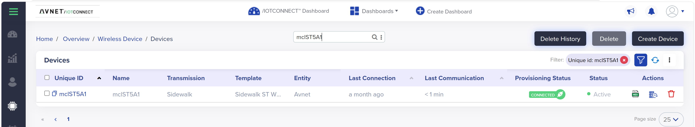
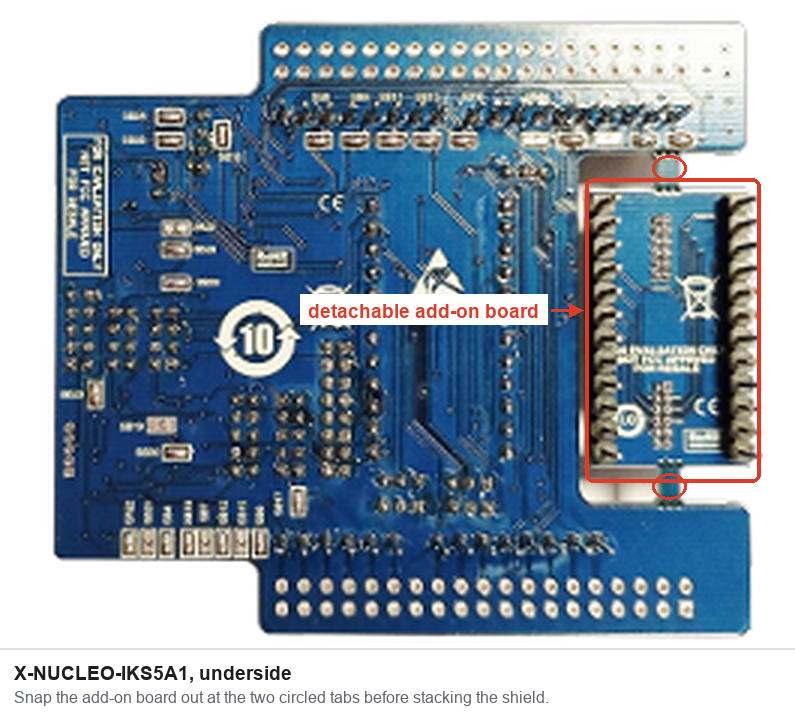
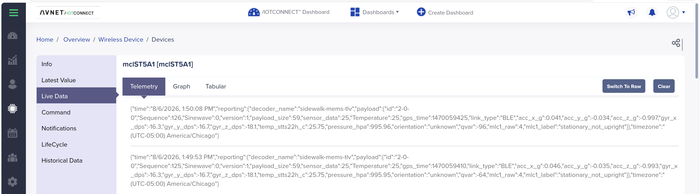
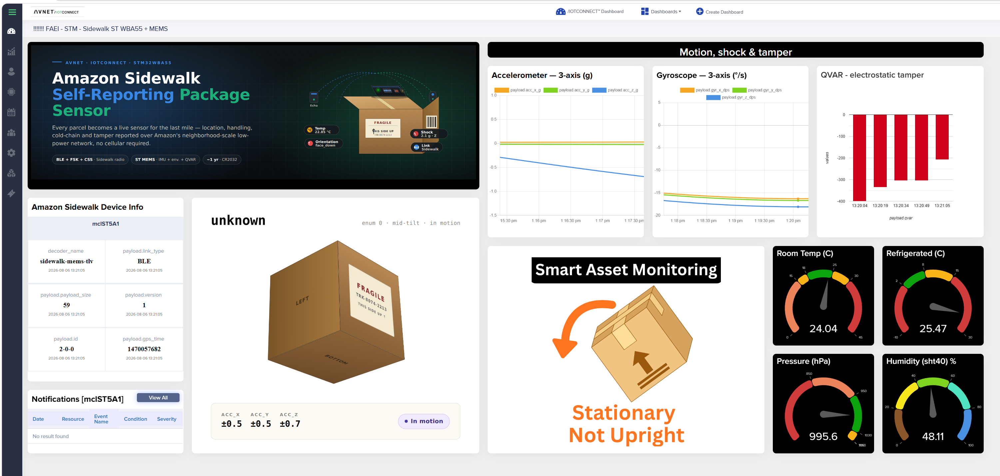

# QuickStart: STM32 Amazon Sidewalk MEMS Sensor Demo with /IOTCONNECT

[Purchase the NUCLEO-WBA55CG](https://www.newark.com/stmicroelectronics/nucleo-wba55cg/dev-brd-nucleo-64-32bit-arm-cortex/dp/94AK4277) &nbsp;•&nbsp; [Purchase the NUCLEO-WBA65RI](https://www.newark.com/stmicroelectronics/nucleo-wba65ri/dev-brd-nucleo-64-arm-cortex-m33f/dp/25AM5396) &nbsp;•&nbsp; [Purchase the X-NUCLEO-IKS4A1](https://www.newark.com/stmicroelectronics/x-nucleo-iks4a1/expansion-brd-mems-environmental/dp/04AM0395) &nbsp;•&nbsp; [Purchase the X-NUCLEO-IKS5A1](https://www.newark.com/stmicroelectronics/x-nucleo-iks5a1/expansion-brd-mems-environmental/dp/51AM2356)

> [!NOTE]
> **Two host boards are supported.** This guide is written around the **NUCLEO-WBA55CG**, but the **NUCLEO-WBA65RI** (STM32WBA65RI, 2 MB flash) works too and follows the exact same steps. Wherever a WBA55-specific value appears — the firmware hex names, the `provision-device.py` chip argument, the `BOARD=` build flag, and the raw `mfg.bin` flash address — the WBA65 equivalent is noted alongside it. Pick one board and follow the matching values throughout.


_The X-NUCLEO-IKS4A1 / IKS5A1 MEMS sensor shield stacked on the NUCLEO-WBA55CG Arduino headers (Step 8; a NUCLEO-WBA65RI hosts the same shield identically). The board reaches /IOTCONNECT over Amazon Sidewalk (BLE / Link Type 1) via a nearby gateway (e.g. Amazon Echo) and the AWS backend._


## 1. Introduction

This guide walks through bringing a **NUCLEO-WBA55CG** (or **NUCLEO-WBA65RI**) with an **X-NUCLEO-IKS4A1** (or **X-NUCLEO-IKS5A1**) MEMS sensor expansion board online with the Avnet **/IOTCONNECT** platform over **Amazon Sidewalk** (BLE / Link Type 1). When complete, the board streams live accelerometer, gyroscope, temperature, humidity, pressure, orientation, and Qvar (capacitive touch) readings to an /IOTCONNECT dashboard, and you can send commands back to the device.

The firmware is built from source — licensing on the upstream SDK and crypto library prevents this repository from redistributing compiled images (see [`NOTICE.md`](NOTICE.md)). Step 9 covers the build with a one-command helper script; the detailed [example README](examples/sidewalk-mems-wba55/README.md) covers the full toolchain setup, and this QuickStart references it where useful.

Because the data travels over Amazon Sidewalk, your device reaches the cloud through any nearby **Sidewalk gateway** (for example, a compatible Amazon Echo) — no local Wi-Fi credentials are programmed onto the board.

| | |
|---|---|
|  |  |
| _Sidewalk onboarding: a per-device certificate is provisioned, then the manufacturing data is flashed onto the board._ | _A compatible Amazon Echo (4th Gen) can act as the Sidewalk gateway that relays your uplinks to the cloud._ |

> [!NOTE]
> Amazon Sidewalk coverage is required for the device to connect. Make sure a compatible Sidewalk gateway is powered on, within range, and has Amazon Sidewalk enabled. See [Amazon Sidewalk gateway](#amazon-sidewalk-gateway) in Step 2 for compatible devices and setup.

---

## 2. Prerequisites

**Hardware**

* [NUCLEO-WBA55CG](https://www.newark.com/stmicroelectronics/nucleo-wba55cg/dev-brd-nucleo-64-32bit-arm-cortex/dp/94AK4277) — Sidewalk host MCU (STM32WBA55CG, 1 MB flash; programmed over the on-board ST-LINK). **Or** a [NUCLEO-WBA65RI](https://www.newark.com/stmicroelectronics/nucleo-wba65ri/dev-brd-nucleo-64-arm-cortex-m33f/dp/25AM5396) (STM32WBA65RI, 2 MB flash) — same steps, using the WBA65 values noted throughout this guide.
* **One of:** [X-NUCLEO-IKS4A1](https://www.newark.com/stmicroelectronics/x-nucleo-iks4a1/expansion-brd-mems-environmental/dp/04AM0395) *or* [X-NUCLEO-IKS5A1](https://www.newark.com/stmicroelectronics/x-nucleo-iks5a1/expansion-brd-mems-environmental/dp/51AM2356) MEMS sensor expansion board
* USB micro-B cable (ST-LINK programming + UART log)
* A compatible **Amazon Sidewalk gateway** in range — see the next subsection

**Software**

* PC running Windows 11, macOS, or Linux
* [STM32CubeProgrammer](https://www.st.com/en/development-tools/stm32cubeprog.html) (provides the `STM32_Programmer_CLI` used for flashing)
* [Python 3.10+](https://www.python.org/downloads/) (used to generate the per-device manufacturing image)
* A Serial Terminal application such as [Tera Term](https://teratermproject.github.io/index-en.html), [PuTTY](https://www.putty.org/), or `screen` (115200 8N1)

### Get this repository

**[Download the repository ZIP](https://github.com/avnet-iotconnect/iotc-stm32-sidewalk/archive/refs/heads/main.zip)**, then extract it anywhere convenient (e.g. `Downloads\iotc-stm32-sidewalk-main`). That is all you need — this is a public repository, so the download works for anyone, with **no GitHub account, no sign-in, and no `git` installation**.

Everything this guide references (templates, decoders, dashboards, and the provisioning script) is inside that ZIP. If you would rather use Git, `git clone https://github.com/avnet-iotconnect/iotc-stm32-sidewalk.git` gets you the same content.

### Amazon Sidewalk gateway

Your board does **not** join your Wi-Fi. It reaches the cloud through a nearby **Amazon Sidewalk gateway** (Amazon calls these *bridges*) — a consumer Amazon device that is already on someone's Wi-Fi and donates a sliver of its bandwidth to relay Sidewalk traffic. You do not need to buy a dedicated gateway if one is already in range.

This demo uses **Sidewalk over BLE (Link Type 1)**, so any Sidewalk gateway with BLE support works. Common ones:

| Amazon device | Sidewalk radios | Works for this demo (BLE) |
|---|---|:--:|
| Echo (4th Gen), Echo Show 15 (2nd Gen), Echo Show 21 | BLE + Sub-GHz (CSS + FSK) | ✅ |
| Echo Hub | BLE + Sub-GHz (CSS) | ✅ |
| Echo Dot (5th Gen), Echo Dot Max (Gen 6), Echo Pop, Echo Spot (2024), Echo Studio (Gen 5), Echo Show 8 (Gen 4), Echo Show 11 (Gen 2) | BLE only | ✅ |
| Ring Bridge (2nd Gen), Ring Wired Doorbell Pro (2021), Ring Floodlight Cam Wired 4K | BLE + Sub-GHz (CSS + FSK) | ✅ |
| Ring Floodlight Cam Wired Plus, Ring Wired Doorbell Pro 4K, Ring Outdoor Cam Pro | Sub-GHz only (no BLE) | ❌ |
| Ring Alarm Pro Base Station | Sub-GHz FSK only | ❌ |

The full, current list is in the [Amazon Sidewalk gateway documentation](https://docs.sidewalk.amazon/introduction/sidewalk-gateways.html).

**General gateway setup** — a one-time job, and if you already use an Echo at home it is probably done:

1. **Plug the gateway in** and keep it powered — it must stay online for your device to reach the cloud.
2. **Connect it to a local Wi-Fi network.** In the Alexa app: **More → Add a Device → Amazon Echo**, then follow the prompts to join your Wi-Fi. Sidewalk rides on this internet connection.
3. **Enable Amazon Sidewalk.** New devices offer this during setup — choose **Enable**. For a gateway you already own: **Alexa app → More → Settings → Account Settings → Amazon Sidewalk → Enable**. (Ring devices: **Ring app → Control Center → Amazon Sidewalk**.)
4. **Place the gateway within BLE range** of your Nucleo board — same room is ideal; expect a couple of walls at most.

> [!NOTE]
> Amazon Sidewalk is currently **available in the United States only**, and the gateway must be registered to an Amazon account. Your development board does not need to be on the same account as the gateway — Sidewalk gateways relay for any authorized Sidewalk endpoint in range.

---

## 3. Create /IOTCONNECT Account

An /IOTCONNECT account with an **AWS backend** is required (Amazon Sidewalk runs on AWS IoT Wireless). If you need an account, a free trial subscription is available, directly from [iotconnect.io](https://iotconnect.io) or through the AWS Marketplace.

* Option #1 **(Recommended)**
  /IOTCONNECT via [AWS Marketplace](https://github.com/avnet-iotconnect/avnet-iotconnect.github.io/blob/main/documentation/iotconnect/subscription/iotconnect_aws_marketplace.md) — 60-day trial; AWS account creation required.

* Option #2
  /IOTCONNECT via [iotconnect.io](https://subscription.iotconnect.io/subscribe?cloud=aws) — 30-day trial; no credit card required.

> [!NOTE]
> Be sure to check any SPAM folder for the temporary password after registering. Amazon Sidewalk **requires the AWS backend**, so make sure your subscription is the AWS variant.

---

## 4. Import the Device Template

The **device template** defines the telemetry attributes and downlink commands for the MEMS demo, and the **decoder** turns the raw Sidewalk TLV uplink into named values.

1. Download the pre-made device template from this repo: [`device-templates/sidewalk_st_WBA55+MEMS_template.JSON`](device-templates/sidewalk_st_WBA55+MEMS_template.JSON) (template code `STswMEMS`, *“Sidewalk ST WBA55 + MEMS”*). The same template covers both the IKS4A1 and IKS5A1 boards.
2. Login to the platform at [console.iotconnect.io](https://console.iotconnect.io).
3. From the navigation panel on the left, select the **Devices** icon and choose **Wireless Device** from the sub-menu.<br>
4. At the bottom of the page, select the **Templates** icon from the toolbar.<br>
5. At the top-right of the page, select the **Create Template** button.<br>
6. At the top-right of the page, select the **Import** button.<br>
7. Click **Browse**, navigate to and select the downloaded `sidewalk_st_WBA55+MEMS_template.JSON`.
8. Click **Save**.

### About the decoder

Sidewalk is a low-bandwidth network, so the firmware does not send JSON. It packs each reading into a compact binary **TLV** (tag-length-value) frame — a few dozen bytes carrying accelerometer, gyro, temperature, pressure, and Qvar values — and that frame arrives in the cloud as base64. A **decoder** is the small piece of Python that turns those bytes back into named values.

Here is where it sits in the path from board to dashboard:

```
Board  ──BLE──▶  Sidewalk gateway  ──▶  AWS IoT Wireless  ──▶  /IOTCONNECT Lambda
(packs TLV)         (Echo / Ring)         (deduplicates)         (runs the DECODER)
                                                                        │
                                              dashboards & rules  ◀── template attributes
                                                                   (JSON mapped by name)
```

The decoder runs inside the /IOTCONNECT Lambda, before the platform stores anything. Its output keys are matched **by name, case-sensitively**, against the attributes declared in your device template — an attribute the decoder never emits stays empty, and a key with no matching attribute is discarded. That name mismatch is the single most common reason a device shows as connected but never populates Live Data.

/IOTCONNECT offers two kinds of decoder:

| Decoder | Use |
|---|---|
| **Raw Data Default** | Passes the raw payload straight through — useful only to confirm bytes are arriving |
| **Custom Decoder** | Your own Python, mapping the payload to template attributes — what this demo uses |

This repo ships the matching custom decoder: [`decoders/sidewalk-mems-tlv.py`](decoders/sidewalk-mems-tlv.py). It walks the TLV stream, skips unknown tags rather than failing, and returns scaled SI values (g, dps, °C, %RH, hPa) under exactly the names the `STswMEMS` template declares. One decoder serves both sensor boards — the IKS5A1 simply leaves the fields it has no sensor for empty. /IOTCONNECT decoders use a fixed entry point:

```python
def dict_from_payload(base64_input: str, fport: int = None):
    return {"payload": {...}}
```

You can run it locally before uploading anything — it builds a synthetic payload, decodes it, and prints the result (expect ~23 °C, ~42 %RH, ~1013 hPa):

```
python decoders/sidewalk-mems-tlv.py
```

**Submit it for approval, then attach it to the template.** Custom decoders are reviewed by /IOTCONNECT before they can run in the cloud — allow roughly **24 hours**. While yours is in review you can still prove the end-to-end path today using the already-approved `STsidewalk2` decoder, which reads the whole-degree temperature tag our firmware also emits — see [section 12 of the example README](examples/sidewalk-mems-wba55/README.md#12-temporary-device--validate-today-using-the-alreadyapproved-decoder).

---

## 5. Create a Sidewalk Device

In this step you create a **Wireless Device** of transmission type **Sidewalk**, associated with the template you just imported. /IOTCONNECT registers it with AWS IoT Wireless and generates the per-device Sidewalk credentials.

1. From the navigation panel on the left, select the **Devices** icon and choose **Wireless Device** from the sub-menu.<br>
2. At the top-right, click **Create Device**.
3. Fill in the fields:
   * **Transmission Type:** select **Sidewalk**
   * **Unique ID (DUID):** a unique identifier for this unit, e.g. `wba55-mems-01`. **Pick this carefully — it cannot be changed later**, and you will pass it to the provisioning script in Step 7.
   * **Device Type / Hardware:** select the option matching your STM32WBA55 (or STM32WBA65) hardware
   * **Display Name:** a friendly name, e.g. `WBA55 MEMS Demo`
   * **Entity:** select the entity to own the device (new accounts have a single option)
   * **Template:** select the imported template `STswMEMS`
4. Click **Save & View**. Saving whitelists the device with AWS IoT Wireless for authorization.


_(Screen: Create Device)_

After saving, the device appears in the Sidewalk device list, ready to be provisioned and flashed.



_(Screen: Sidewalk Device List)_

---

## 6. Obtain the Device Certificate

Amazon Sidewalk provisions each device with a unique **certificate JSON** (the Sidewalk manufacturing credentials, sometimes called the *device bundle*). You will convert this into a board-flashable manufacturing image in the next step.

The download is available in two places — either works, and both give you the same file:

**From the device overview page (easiest).** You are already here if you clicked **Save & View** in Step 5. Otherwise open the device from the **Wireless Device** list. The certificate download sits with the device's other actions on this page.

**From the Wireless Device list.** Find your device, look at the **Actions** column on the right, and click the certificate download icon.


> [!NOTE]
> The /IOTCONNECT console is updated regularly, so **the icon may not look exactly like the screenshot above** (it was a green *HEX* icon when this guide was written). Hover over the icons in the **Actions** column — the certificate download is the one that is not the history icon (clock) or delete (red trash can).

**The downloaded file is normally named `certificate.json`**, not `<device name>.json` — the browser does not name it after your device. If you are provisioning more than one board, rename each download as soon as it lands (e.g. `wba55-mems-01.json`) or keep them in separate folders, because a second download will otherwise overwrite the first or land as `certificate (1).json`.

Save the file somewhere you can reach from a terminal, e.g. your `Downloads` folder.

> [!IMPORTANT]
> The certificate JSON contains **device private keys**. Treat it like an SSH key: never commit it, never paste it into chat/email/tickets, and delete it from shared machines after flashing. This repository already `.gitignore`s the `binaries/sidewalk-mfg/` directory where the generated artifacts land.

---

## 7. Generate the Manufacturing Image

The certificate JSON must be converted into a **board-format manufacturing image** (`mfg.bin` / `mfg.hex`) before it can be flashed. A helper script in this repo wraps the SDK's `provision.py` and writes the output to a per-device folder.

### One-time setup: get the STM32-Sidewalk-SDK

The provisioning logic lives in ST's SDK, so you need a copy of it alongside this repository. **[Download the SDK ZIP](https://github.com/stm32-hotspot/STM32-Sidewalk-SDK/archive/refs/heads/main.zip)** (~53 MB, also public — no account needed) and extract it **next to** your `iotc-stm32-sidewalk` folder, renaming it `STM32-Sidewalk-SDK`:

```
Downloads/
├── iotc-stm32-sidewalk-main/     <-- this repo
└── STM32-Sidewalk-SDK/           <-- the SDK, extracted alongside it
```

The script finds the SDK there automatically. If you keep it elsewhere, point at it with `--sdk-root` or the `SDK_ROOT` environment variable.

The SDK's provisioning tool needs two Python packages:

```
python -m pip install pyyaml intelhex
```

### Run the provisioning script

Run this **from the root of the extracted repo folder**:

```
python scripts/provision-device.py <device-name> <path-to-cert.json> [chip]
```

* `<device-name>` — the device's **Unique ID** from Step 5 (e.g. `wba55-mems-01`). It names the output folder, so using the Unique ID is what lets you match a generated image back to the device it belongs to. It is *not* read from the certificate, so a typo here silently produces a confusingly-named folder rather than an error.
* `<path-to-cert.json>` — the file you downloaded in Step 6. It is normally called **`certificate.json`**.
* `[chip]` — optional; defaults to **`WBA55xG`** (NUCLEO-WBA55CG). Pass **`WBA65xI`** for the NUCLEO-WBA65RI. The script picks the matching mfg flash address automatically.

Examples:

```
python scripts/provision-device.py wba55-mems-01 certificate.json            # WBA55 (default)
python scripts/provision-device.py wba65-mems-01 certificate.json WBA65xI    # WBA65
```

This produces (WBA55 shown; on WBA65 the `mfg.bin` flashes @ `0x081FE000`):

```
binaries/sidewalk-mfg/wba55-mems-01/
├── cert.json
├── mfg.bin      <-- flash this @ 0x080FE000  (WBA65: 0x081FE000)
└── mfg.hex
```

> [!IMPORTANT]
> **`provision-device.py` is a Python script — run it with `python`.** There is also a `provision-device.sh` in the same folder. That one is a **bash** script for Linux, macOS, WSL, or Git Bash, and it must be run with `bash` (or `./`), never with `python`. Handing the `.sh` file to Python produces a confusing syntax error, because Python is trying to parse shell:
>
> ```
> PS> python ./scripts/provision-device.sh StevensWBA55 certificate.json
>   File "...\scripts\provision-device.sh", line 34
>     WBA65xI|WBA64xI|WBA63xI|WBA62xI) MFG_ADDR="0x081FE000" ;;
>                                    ^
> SyntaxError: closing parenthesis ')' does not match opening parenthesis '['
> ```
>
> On Windows, use `python scripts/provision-device.py …` — it needs nothing beyond the Python you already installed, and works the same in PowerShell, cmd, and a terminal inside VS Code.

> [!NOTE]
> Do **not** flash the raw certificate JSON, and do not reuse a `mfg.bin` from anywhere else — each image is bound to one device. Always generate it with the provisioning script (which runs `provision.py st aws --chip WBA55xG`, or `--chip WBA65xI` for the WBA65) first.

---

## 8. Setup Hardware

1. **Snap the detachable add-on board out of the MEMS shield.** The X-NUCLEO-IKS4A1 and IKS5A1 each ship as a **single PCB panel**: the Arduino-format sensor shield, plus a small **add-on board** sitting in a cut-out and held there by two thin perforated tabs. Break it out before you stack the shield — the panel will not seat properly on the host board while it is still attached. (On the IKS4A1 this add-on is the **STEVAL-MKE001A**.)

   

   Support the panel flat with the add-on just past the edge of a table, hold it close to the tabs, and **flex it straight down until the tabs snap** — do not twist, and keep your fingers off the components and pin headers. The tabs are scored to break cleanly by hand; no cutting tool is needed. Keep the add-on board: its pin headers plug into the **DIL24 socket** on the shield when you want to use the sensor it carries.

2. **Stack** the MEMS expansion board onto the NUCLEO-WBA55CG (or NUCLEO-WBA65RI): align the **X-NUCLEO-IKS4A1** (or **IKS5A1**) onto the Arduino headers and press firmly until fully seated. No jumpers or extra wiring are needed — the sensors talk over the Arduino I²C connector.
3. **Connect** the USB micro-B cable from your PC to the board's ST-LINK port.
4. Confirm the board powers up (the ST-LINK LED illuminates).

> [!NOTE]
> **WBA65 users:** the firmware's sensor-shield Arduino-I²C pin mapping currently defaults to the known-good WBA55 pinout and has **not yet been confirmed against the NUCLEO-WBA65RI schematic**. Confirm the Arduino-I²C pins against the board schematic before trusting sensor data on the WBA65.

> [!NOTE]
> Use the firmware variant that matches your physical board (IKS4A1 firmware on the IKS4A1 board, IKS5A1 firmware on the IKS5A1 board). A mismatch shows up as an IMU `init failed` message in the serial log.

---

## 9. Build and Flash the Firmware

You build the firmware yourself; pre-built images are not distributed in this repository (see `NOTICE.md` for the licensing rationale). You then flash **two** images: the firmware and the per-device manufacturing data from Step 7.

> [!NOTE]
> If your board arrived already flashed with this demo firmware, skip ahead to **Step 10**, plug it in, and confirm the boot banner on the UART. You still need your own manufacturing image from Step 7 unless the board was provisioned with a device you own.

### Build the firmware locally

```bash
./scripts/build-firmware.sh           # both IKS4A1 and IKS5A1 variants (WBA55)
./scripts/build-firmware.sh iks4a1    # IKS4A1 only
./scripts/build-firmware.sh iks5a1    # IKS5A1 only

BOARD=wba65 ./scripts/build-firmware.sh   # build the WBA65 hex(es) instead (BOARD defaults to wba55)
```

The `BOARD` env var selects the host board (default `wba55`); `BOARD=wba65` builds the WBA65 variants from the STM32WBA65 CubeIDE project (`STM32CubeIDE/STM32WBA65`, `Debug_Nucleo-WBA65` config) that the SDK already ships.

> [!NOTE]
> This build helper is a **bash** script and drives STM32CubeIDE's headless builder. On Windows, run it from **Git Bash** or WSL. If you would rather not, open the CubeIDE project in the IDE and build it from the GUI — the [example README](examples/sidewalk-mems-wba55/README.md) walks through that path and produces the same hex.

Prerequisites — STM32CubeIDE, the STM32-Sidewalk-SDK adjacent to this repo, X-CUBE-MEMS1 BSP drivers, and X-CUBE-CRYPTOLIB (CMOX) downloaded from st.com with click-through accepted. See [examples/sidewalk-mems-wba55/README.md](examples/sidewalk-mems-wba55/README.md) for the full setup. Output lands at:

```
binaries/sid_ble_wba55_iks4a1.hex     # (WBA65: sid_ble_wba65_iks4a1.hex)
binaries/sid_ble_wba55_iks5a1.hex     # (WBA65: sid_ble_wba65_iks5a1.hex)
```

Pick the one that matches your host board + sensor board:

| Physical board | Firmware hex |
|---|---|
| NUCLEO-WBA55CG + **X-NUCLEO-IKS4A1** | `binaries/sid_ble_wba55_iks4a1.hex` |
| NUCLEO-WBA55CG + **X-NUCLEO-IKS5A1** | `binaries/sid_ble_wba55_iks5a1.hex` |
| NUCLEO-WBA65RI + **X-NUCLEO-IKS4A1** | `binaries/sid_ble_wba65_iks4a1.hex` |
| NUCLEO-WBA65RI + **X-NUCLEO-IKS5A1** | `binaries/sid_ble_wba65_iks5a1.hex` |

### Flash the two images

Three commands, in this order — erase, firmware, manufacturing data. These run anywhere `STM32_Programmer_CLI` is on your `PATH`, including Windows PowerShell (WBA55 + IKS4A1 shown; swap the firmware hex for the IKS5A1 or WBA65 build if needed):

```
STM32_Programmer_CLI -c port=SWD mode=UR -e all
STM32_Programmer_CLI -c port=SWD mode=UR -d binaries/sid_ble_wba55_iks4a1.hex -v
STM32_Programmer_CLI -c port=SWD mode=UR -d binaries/sidewalk-mfg/wba55-mems-01/mfg.hex -v
```

The `mfg.hex` carries its own flash address, so nothing extra is needed. If you flash the raw `mfg.bin` instead, you must supply the address yourself — `0x080FE000` on WBA55, `0x081FE000` on WBA65:

```
STM32_Programmer_CLI -c port=SWD mode=UR -d binaries/sidewalk-mfg/wba55-mems-01/mfg.bin 0x080FE000 -v
```

> [!NOTE]
> **Windows:** if `STM32_Programmer_CLI` is not recognized, either add its folder to your `PATH` or call it by full path — by default `C:\Program Files\STMicroelectronics\STM32Cube\STM32CubeProgrammer\bin\STM32_Programmer_CLI.exe`.

On Linux, macOS, WSL, or Git Bash you can instead use [`tools/flash_wba55.sh`](tools/flash_wba55.sh), which runs the same three steps with an automatic one-shot retry on each. It is board-agnostic — pass whichever firmware hex and `mfg.hex` you built:

```bash
tools/flash_wba55.sh \
  binaries/sid_ble_wba55_iks4a1.hex \
  binaries/sidewalk-mfg/wba55-mems-01/mfg.hex
```

After flashing, **press the black RESET button** (or power-cycle) to start the firmware.

> [!NOTE]
> If `STM32_Programmer_CLI` returns `DEV_CONNECT_ERR` repeatedly, **hold the black RESET button** on the Nucleo while the command starts. Between Sidewalk BLE advertising windows the WBA55 / WBA65 enters a low-power mode that gates the SWD pads; holding RESET keeps the CPU awake long enough for the programmer to attach.

---

## 10. Check Connectivity

Open the board's USB serial port at **115200 8N1**. On first boot you should see the device validate its manufacturing data, register with Sidewalk, and begin sending uplinks:

```
[INFO]: MFG storage: validation passed
[INFO]: IKS4A1: sensors initialized
[INFO]: Sidewalk demo started
[INFO]: Sidewalk registration status: Not registered  ->  Sidewalk Device Registration done
[INFO]: Established BLE connection ...
[INFO]: IKS4A1 action uplink seq=0 ...
```

> [!NOTE]
> First-boot registration and Sidewalk BLE re-acquisition mean the first uplink can take a couple of minutes to appear. The send cadence is roughly one uplink every ~2 minutes — that gap is Sidewalk's BLE window, not a firmware delay.

Back in /IOTCONNECT, find your device in the **Wireless Device** list and open its **Live Data** tab to confirm telemetry is flowing.



_(Screen: the device's **Live Data → Telemetry** tab — each record is the decoded `sidewalk-mems-tlv` payload: accel/gyro, temperature, pressure, `qvar`, `orientation`, and `mlc1_label`.)_

Sanity-check values for a device sitting on a desk: accel ≈ (0, 0, 1000) mg, gyro ≈ (0, 0, 0) dps, temperature ≈ 22–25 °C, humidity ≈ 30–60 %RH, pressure ≈ 1000–1015 hPa. Touch the silver Qvar pads on the edge of the expansion board to watch the `qvar` field swing.

### If no telemetry appears

The board's serial log tells you which half of the path to look at. If the log shows uplinks going out but Live Data stays empty, the problem is cloud-side — almost always the decoder:

| Symptom | Likely cause | Check / fix |
|---|---|---|
| Device shows **Connected**, Live Data empty | Decoder not attached, or still awaiting approval | Confirm the custom decoder is approved and attached to the `STswMEMS` template (Step 4) |
| Some attributes populate, others stay empty | Decoder output names do not match template attributes | Names are matched **case-sensitively** — compare the decoder's output keys against the template's attribute list |
| Nothing at all, and **Last Communication** never updates | Device is not reaching a gateway | Move the board next to the Sidewalk gateway; confirm Sidewalk is enabled on it (Step 2) |
| Serial log stops at `MFG storage` | Wrong or missing manufacturing image | Re-flash `mfg.hex` for *this* device (Steps 6–7) — an image from another device will not register |
| Serial log shows IMU `init failed` | Firmware/shield mismatch | Flash the hex matching your physical sensor board (IKS4A1 vs IKS5A1) |

### Data sent to the cloud (per board)

Both boards share the same TLV wire format and the single `STswMEMS` template; the IKS5A1 simply leaves a few fields empty. A ✅ means the attribute is populated on every action uplink.

| Cloud attribute | Sensor (IKS4A1 / IKS5A1) | IKS4A1 | IKS5A1 |
|---|---|:--:|:--:|
| `acc_x_g`, `acc_y_g`, `acc_z_g` | LSM6DSV16X / ISM6HG256X (g) | ✅ | ✅ |
| `gyr_x_dps`, `gyr_y_dps`, `gyr_z_dps` | LSM6DSV16X / ISM6HG256X (dps) | ✅ | ✅ |
| `temp_stts22h_c` | STTS22H / ILPS22QS (°C) | ✅ | ✅ |
| `pressure_hpa` | LPS22DF / ILPS22QS (hPa) | ✅ | ✅ |
| `qvar` | LIS2DUXS12 / IIS2DULPX (raw count) | ✅ | ✅ |
| `temp_sht40_c` | SHT40AD1B (°C) | ✅ | — |
| `humidity_sht40_pct` | SHT40AD1B (%RH) | ✅ | — |
| `orientation` | LSM6DSV16X 6D engine | ✅ | — |
| `mlc1_label` (+ `mlc1_raw`, `mlc1_model_id`, `mlc1_model_name`) | LSM6DSV16X / ISM6HG256X MLC (asset_tracking) | ✅ | ✅ |
| `sensor_data` / `Temperature` | whole-°C temperature (for the standard widget) | ✅ | ✅ |
| `Sequence`, `gps_time`, `link_type`, `version` | firmware / Sidewalk metadata | ✅ | ✅ |

> The IKS5A1 omits SHT40 temperature/humidity and 6D orientation (reported as `unknown` — its 6D path is not yet wired in firmware). It **does** run the ISM6HG256X **MLC asset-tracking** classifier, emitting the same `mlc1_label` classes and model id as the IKS4A1, so the shared decoder handles both boards unchanged.

---

## 11. Import the Dashboard

/IOTCONNECT dashboards visualize your device's telemetry with charts, gauges, and widgets. This repo includes a ready-made dashboard for the MEMS demo — accelerometer / gyroscope / QVAR charts, a live 3D orientation cube, and Room Temp, Refrigerated, Pressure, and Humidity gauges.

1. Download the dashboard export from this repo: [`dashboard-templates/sidewalk_st_WBA55+MEMS_dashboard_export.json`](dashboard-templates/sidewalk_st_WBA55+MEMS_dashboard_export.json).
2. In /IOTCONNECT, open the **Dashboards** menu at the top of the page and choose **Create Dashboard**.
3. Choose **Import**, then **Browse** to the downloaded `sidewalk_st_WBA55+MEMS_dashboard_export.json`.
4. When prompted, bind the widgets to your device — select the template `STswMEMS` and your device's **Unique ID** — then give the dashboard a name and **Save**.



_(Screen: the imported dashboard populated with live MEMS telemetry — motion / shock / tamper charts, a 3D orientation cube, and environmental gauges.)_

> [!NOTE]
> The dashboard binds to the `STswMEMS` template attributes, so import the template (Step 4) and confirm telemetry is flowing (Step 10) first. Some widgets (SHT40 temperature/humidity, orientation, MLC activity) only populate on **IKS4A1** boards — see the per-board table in Step 10.

---

## 12. Send a Command (Downlink)

The template ships with three downlink commands that travel from the cloud back to the device over Sidewalk:

| Command | Effect |
|---|---|
| **LED_ON** | Turn the user LED on |
| **LED_OFF** | Turn the user LED off |
| **SET_INTERVAL** | Change the uplink period (seconds, clamped to 60–3600) |

Open the device's **Command** tab, choose a command (supply the interval value for `SET_INTERVAL`), and send it. The device logs the received opcode on its serial console (`CMD led_on`, `CMD set_interval -> 300 s`).


_(Screen: Command)_

> [!NOTE]
> Downlink commands require a cloud-side translator that converts the template's JSON command descriptors into the raw opcode bytes the firmware expects. This repo includes that translator ([`decoders/iks4a1_downlink_translator.py`](decoders/iks4a1_downlink_translator.py)) plus a `bytesCommand` REST alternative — see [section 9 of the example README](examples/sidewalk-mems-wba55/README.md#9-downlink-commands-cloud--device).

---

## 13. Resources

* [MEMS Sensor Demo — full example README](examples/sidewalk-mems-wba55/README.md) (build-from-source, payload wire format, troubleshooting)
* [Binaries & provisioning details](binaries/README.md)
* [Repository overview](README.md)
* /IOTCONNECT Sidewalk device docs: [Sidewalk Device](https://docs.iotconnect.io/iotconnect/user-manuals/devices/device/sidewalk) · [Wireless Device Types](https://docs.iotconnect.io/iotconnect/concepts/device-types/wireless-device/)
* Hardware: [NUCLEO-WBA55CG](https://www.newark.com/stmicroelectronics/nucleo-wba55cg/dev-brd-nucleo-64-32bit-arm-cortex/dp/94AK4277) · [NUCLEO-WBA65RI](https://www.newark.com/stmicroelectronics/nucleo-wba65ri/dev-brd-nucleo-64-arm-cortex-m33f/dp/25AM5396) · [X-NUCLEO-IKS4A1](https://www.newark.com/stmicroelectronics/x-nucleo-iks4a1/expansion-brd-mems-environmental/dp/04AM0395) · [X-NUCLEO-IKS5A1](https://www.newark.com/stmicroelectronics/x-nucleo-iks5a1/expansion-brd-mems-environmental/dp/51AM2356)
* Amazon Sidewalk: [supported gateways](https://docs.sidewalk.amazon/getting-started/) · [device lifecycle](https://docs.sidewalk.amazon/manufacturing/sidewalk-device-lifecycle.html)

---

> [!IMPORTANT]
> This QuickStart uses the Amazon Sidewalk **prototyping flow** (per-device certificate JSON, flashed individually; up to 1,000 prototype devices). It is intended for development, validation, and demos — **not** the Sidewalk factory manufacturing flow. For production rollout, engage the **/IOTCONNECT team** and **AWS** to integrate the Amazon Sidewalk manufacturing flow into your own AWS account. See the [repository README](README.md#amazon-sidewalk-production-support-in-iotconnect) for details.
