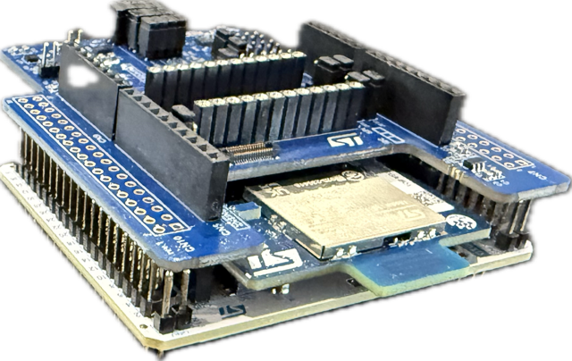
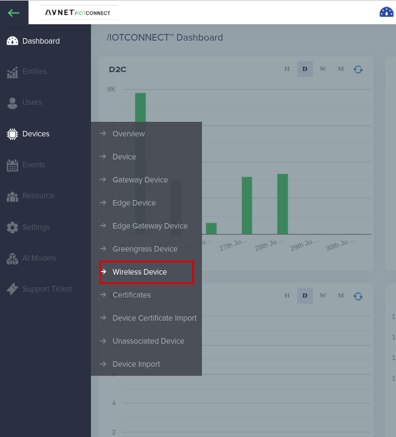

# QuickStart: STM32 Amazon Sidewalk MEMS Sensor Demo with /IOTCONNECT

[Purchase the NUCLEO-WBA55CG](https://estore.st.com/en/nucleo-wba55cg-cpn.html) &nbsp;•&nbsp; [Purchase the X-NUCLEO-IKS4A1](https://estore.st.com/en/x-nucleo-iks4a1-cpn.html) &nbsp;•&nbsp; [Purchase the X-NUCLEO-IKS5A1](https://estore.st.com/en/x-nucleo-iks5a1-cpn.html)


_The X-NUCLEO-IKS4A1 / IKS5A1 MEMS sensor shield stacked on the NUCLEO-WBA55CG Arduino headers (Step 8). The WBA55 reaches /IOTCONNECT over Amazon Sidewalk (BLE / Link Type 1) via a nearby gateway (e.g. Amazon Echo) and the AWS backend._


## 1. Introduction

This guide walks through bringing a **NUCLEO-WBA55CG** with an **X-NUCLEO-IKS4A1** (or **X-NUCLEO-IKS5A1**) MEMS sensor expansion board online with the Avnet **/IOTCONNECT** platform over **Amazon Sidewalk** (BLE / Link Type 1). When complete, the board streams live accelerometer, gyroscope, temperature, humidity, pressure, orientation, and Qvar (capacitive touch) readings to an /IOTCONNECT dashboard, and you can send commands back to the device.

The fastest path uses a **pre-compiled firmware image** — no toolchain or build step is required. If you would rather build the firmware from source, follow the detailed [example README](examples/sidewalk-mems-wba55/README.md) instead; this QuickStart references it where useful.

Because the data travels over Amazon Sidewalk, your device reaches the cloud through any nearby **Sidewalk gateway** (for example, a compatible Amazon Echo) — no local Wi-Fi credentials are programmed onto the board.

| | |
|---|---|
|  |  |
| _Sidewalk onboarding: a per-device certificate is provisioned, then the manufacturing data is flashed onto the board._ | _A compatible Amazon Echo (4th Gen) can act as the Sidewalk gateway that relays your uplinks to the cloud._ |

> [!NOTE]
> Amazon Sidewalk coverage is required for the device to connect. Make sure a compatible Sidewalk gateway is powered on, within range, and has Amazon Sidewalk enabled in the Alexa app. See the [list of supported gateways](https://docs.sidewalk.amazon/getting-started/).

---

## 2. Prerequisites

**Hardware**

* [NUCLEO-WBA55CG](https://estore.st.com/en/nucleo-wba55cg-cpn.html) — Sidewalk host MCU (programmed over the on-board ST-LINK)
* **One of:** [X-NUCLEO-IKS4A1](https://estore.st.com/en/x-nucleo-iks4a1-cpn.html) *or* [X-NUCLEO-IKS5A1](https://estore.st.com/en/x-nucleo-iks5a1-cpn.html) MEMS sensor expansion board
* USB micro-B cable (ST-LINK programming + UART log)
* A compatible **Amazon Sidewalk gateway** in range (e.g. Amazon Echo 4th Gen) with Sidewalk enabled

**Software**

* PC running Windows 11, macOS, or Linux
* [STM32CubeProgrammer](https://www.st.com/en/development-tools/stm32cubeprog.html) (provides the `STM32_Programmer_CLI` used for flashing)
* [Python 3.10+](https://www.python.org/downloads/) (used to generate the per-device manufacturing image)
* A Serial Terminal application such as [Tera Term](https://teratermproject.github.io/index-en.html), [PuTTY](https://www.putty.org/), or `screen` (115200 8N1)
* This repository, cloned locally:
  ```bash
  git clone https://github.com/avnet-iotconnect/iotc-stm32-sidewalk.git
  cd iotc-stm32-sidewalk
  ```

---

## 3. Create /IOTCONNECT Account

An /IOTCONNECT account with an **AWS backend** is required (Amazon Sidewalk runs on AWS IoT Wireless). If you need an account, a free trial subscription is available, directly from [iotconnect.io](https://iotconnect.io) or through the AWS Marketplace.

* Option #1 **(Recommended)**
  /IOTCONNECT via [AWS Marketplace](https://github.com/avnet-iotconnect/avnet-iotconnect.github.io/blob/main/documentation/iotconnect/subscription/iotconnect_aws_marketplace.md) — 60-day trial; AWS account creation required.

* Option #2
  /IOTCONNECT via [iotconnect.io](https://subscription.iotconnect.io/subscribe?cloud=aws) — 30-day trial; no credit card required.

> [!NOTE]
> Be sure to check any SPAM folder for the temporary password after registering. Amazon Sidewalk **requires the AWS backend**, so make sure your subscription is the AWS variant.

---

## 4. Import the Device Template

The **device template** defines the telemetry attributes and downlink commands for the MEMS demo, and the **decoder** turns the raw Sidewalk TLV uplink into named values.

1. Download the pre-made device template from this repo: [`device-templates/sidewalk_st_WBA55+MEMS_template.JSON`](device-templates/sidewalk_st_WBA55+MEMS_template.JSON) (template code `STswMEMS`, *“Sidewalk ST WBA55 + MEMS”*). The same template covers both the IKS4A1 and IKS5A1 boards.
2. Login to the platform at [console.iotconnect.io](https://console.iotconnect.io).
3. From the navigation panel on the left, select the **Devices** icon and the **Device** sub-menu.<br>
4. At the bottom of the page, select the **Templates** icon from the toolbar.<br>
5. At the top-right of the page, select the **Create Template** button.<br>
6. At the top-right of the page, select the **Import** button.<br>
7. Click **Browse**, navigate to and select the downloaded `sidewalk_st_WBA55+MEMS_template.JSON`.
8. Click **Save**.

> [!NOTE]
> **Attach the decoder.** Sidewalk uplinks arrive as a base64 TLV payload, so /IOTCONNECT needs the matching Python decoder [`decoders/sidewalk-mems-tlv.py`](decoders/sidewalk-mems-tlv.py) to surface the individual sensor values. Submit it for decoder approval and attach it to this template (allow ~24 h for approval). While it is in review you can validate the full path today using the already-approved `STsidewalk2` decoder — see [section 12 of the example README](examples/sidewalk-mems-wba55/README.md#12-temporary-device--validate-today-using-the-alreadyapproved-decoder).

---

## 5. Create a Sidewalk Device

In this step you create a **Wireless Device** of transmission type **Sidewalk**, associated with the template you just imported. /IOTCONNECT registers it with AWS IoT Wireless and generates the per-device Sidewalk credentials.

1. From the navigation panel on the left, select the **Devices** icon and choose **Wireless Device** from the sub-menu.<br>
2. At the top-right, click **Create Device**.
3. Fill in the fields:
   * **Transmission Type:** select **Sidewalk**
   * **Unique ID (DUID):** a unique identifier for this unit, e.g. `wba55-mems-01`
   * **Device Type / Hardware:** select the option matching your STM32WBA55 hardware
   * **Display Name:** a friendly name, e.g. `WBA55 MEMS Demo`
   * **Entity:** select the entity to own the device (new accounts have a single option)
   * **Template:** select the imported template `STswMEMS`
4. Click **Save & View**. Saving whitelists the device with AWS IoT Wireless for authorization.


_(Screen: Create Device)_

After saving, the device appears in the Sidewalk device list, ready to be provisioned and flashed.


_(Screen: Sidewalk Device List)_

---

## 6. Obtain the Device Certificate

Amazon Sidewalk provisions each device with a unique **certificate JSON** (the Sidewalk manufacturing credentials). You will convert this into a board-flashable manufacturing image in the next step.

1. Open the device you just created.
2. Download the **device certificate JSON** generated for it (provided by /IOTCONNECT / AWS IoT Wireless during device creation). Save it to your working directory, e.g. `~/Downloads/wba55-mems-01.json`.

> [!IMPORTANT]
> The certificate JSON contains **device private keys**. Treat it like an SSH key: never commit it, never paste it into chat/email/tickets, and delete it from shared machines after flashing. This repository already `.gitignore`s the `binaries/sidewalk-mfg/` directory where the generated artifacts land.

---

## 7. Generate the Manufacturing Image

The certificate JSON must be converted into a **WBA55-format manufacturing image** (`mfg.bin` / `mfg.hex`) before it can be flashed. A helper script in this repo wraps the SDK's `provision.py` and writes the output to a per-device, permission-locked folder.

```bash
./scripts/provision-device.sh <device-name> <path-to-cert.json>
```

Example:

```bash
./scripts/provision-device.sh wba55-mems-01 ~/Downloads/wba55-mems-01.json
```

This produces:

```
binaries/sidewalk-mfg/wba55-mems-01/
├── cert.json
├── mfg.bin      <-- flash this @ 0x080FE000
└── mfg.hex
```

> [!NOTE]
> The script requires the [STM32-Sidewalk-SDK](https://github.com/stm32-hotspot/STM32-Sidewalk-SDK) checked out (it uses the SDK's bundled `tools/provision/provision.py`). It defaults to `~/dev/sidewalk/STM32-Sidewalk-SDK`; override with `SDK_ROOT=/path/to/STM32-Sidewalk-SDK`. Do **not** flash the raw certificate or any `mfg.bin` from elsewhere — always run `provision-device.sh` (i.e. `provision.py st aws --chip WBA55xG`) first.

---

## 8. Setup Hardware

1. **Stack** the MEMS expansion board onto the NUCLEO-WBA55CG: align the **X-NUCLEO-IKS4A1** (or **IKS5A1**) onto the Arduino headers and press firmly until fully seated. No jumpers or extra wiring are needed — the sensors talk over the Arduino I²C connector.
2. **Connect** the USB micro-B cable from your PC to the NUCLEO-WBA55CG's ST-LINK port.
3. Confirm the board powers up (the ST-LINK LED illuminates).

> [!NOTE]
> Use the firmware variant that matches your physical board (IKS4A1 firmware on the IKS4A1 board, IKS5A1 firmware on the IKS5A1 board). A mismatch shows up as an IMU `init failed` message in the serial log.

---

## 9. Download and Flash the Pre-Compiled Firmware

Two pre-compiled firmware images ship in this repo — pick the one for your sensor board:

| Physical board | Firmware hex |
|---|---|
| NUCLEO-WBA55CG + **X-NUCLEO-IKS4A1** | [`binaries/sid_ble_wba55_iks4a1.hex`](binaries/sid_ble_wba55_iks4a1.hex) |
| NUCLEO-WBA55CG + **X-NUCLEO-IKS5A1** | [`binaries/sid_ble_wba55_iks5a1.hex`](binaries/sid_ble_wba55_iks5a1.hex) |

You flash **two** images: the firmware and the per-device manufacturing data from Step 7.

### One-shot helper (recommended)

The wrapper erases the chip, then writes the firmware, then writes the MFG image — each step under connect-under-reset (`mode=UR`) with an automatic one-shot retry:

```bash
tools/flash_wba55.sh \
  binaries/sid_ble_wba55_iks4a1.hex \
  binaries/sidewalk-mfg/wba55-mems-01/mfg.hex
```

### Manual equivalent

```bash
# IKS4A1 board shown — swap the firmware hex for the IKS5A1 build if needed
STM32_Programmer_CLI -c port=SWD mode=UR -e all
STM32_Programmer_CLI -c port=SWD mode=UR -d binaries/sid_ble_wba55_iks4a1.hex -v
STM32_Programmer_CLI -c port=SWD mode=UR -d binaries/sidewalk-mfg/wba55-mems-01/mfg.bin 0x080FE000 -v
```

After flashing, **press the black RESET button** (or power-cycle) to start the firmware.

> [!NOTE]
> If `STM32_Programmer_CLI` returns `DEV_CONNECT_ERR` repeatedly, **hold the black RESET button** on the Nucleo while the command starts. Between Sidewalk BLE advertising windows the WBA55 enters a low-power mode that gates the SWD pads; holding RESET keeps the CPU awake long enough for the programmer to attach.

---

## 10. Check Connectivity

Open the board's USB serial port at **115200 8N1**. On first boot you should see the device validate its manufacturing data, register with Sidewalk, and begin sending uplinks:

```
[INFO]: MFG storage: validation passed
[INFO]: IKS4A1: sensors initialized
[INFO]: Sidewalk demo started
[INFO]: Sidewalk registration status: Not registered  ->  Sidewalk Device Registration done
[INFO]: Established BLE connection ...
[INFO]: IKS4A1 action uplink seq=0 ...
```

> [!NOTE]
> First-boot registration and Sidewalk BLE re-acquisition mean the first uplink can take a couple of minutes to appear. The send cadence is roughly one uplink every ~2 minutes — that gap is Sidewalk's BLE window, not a firmware delay.

Back in /IOTCONNECT, find your device in the **Wireless Device** list and open its **Live Data** tab to confirm telemetry is flowing.


_(Screen: Telemetry)_

Sanity-check values for a device sitting on a desk: accel ≈ (0, 0, 1000) mg, gyro ≈ (0, 0, 0) dps, temperature ≈ 22–25 °C, humidity ≈ 30–60 %RH, pressure ≈ 1000–1015 hPa. Touch the silver Qvar pads on the edge of the expansion board to watch the `qvar` field swing.

### Data sent to the cloud (per board)

Both boards share the same TLV wire format and the single `STswMEMS` template; the IKS5A1 simply leaves a few fields empty. A ✅ means the attribute is populated on every action uplink.

| Cloud attribute | Sensor (IKS4A1 / IKS5A1) | IKS4A1 | IKS5A1 |
|---|---|:--:|:--:|
| `acc_x_g`, `acc_y_g`, `acc_z_g` | LSM6DSV16X / ISM6HG256X (g) | ✅ | ✅ |
| `gyr_x_dps`, `gyr_y_dps`, `gyr_z_dps` | LSM6DSV16X / ISM6HG256X (dps) | ✅ | ✅ |
| `temp_stts22h_c` | STTS22H / ILPS22QS (°C) | ✅ | ✅ |
| `pressure_hpa` | LPS22DF / ILPS22QS (hPa) | ✅ | ✅ |
| `qvar` | LIS2DUXS12 / IIS2DULPX (raw count) | ✅ | ✅ |
| `temp_sht40_c` | SHT40AD1B (°C) | ✅ | — |
| `humidity_sht40_pct` | SHT40AD1B (%RH) | ✅ | — |
| `orientation` | LSM6DSV16X 6D engine | ✅ | — (`unknown`) |
| `mlc1_label` (+ `mlc1_raw`, `mlc1_model_id`, `mlc1_model_name`) | LSM6DSV16X MLC | ✅ | — |
| `sensor_data` / `Temperature` | whole-°C temperature (for the standard widget) | ✅ | ✅ |
| `Sequence`, `gps_time`, `link_type`, `version` | firmware / Sidewalk metadata | ✅ | ✅ |

> The IKS5A1 omits SHT40 temperature/humidity, 6D orientation (reported as `unknown`), and the MLC activity classifier — its IMU 6D and MLC paths are not yet wired in firmware.

---

## 11. Send a Command (Downlink)

The template ships with three downlink commands that travel from the cloud back to the device over Sidewalk:

| Command | Effect |
|---|---|
| **LED_ON** | Turn the user LED on |
| **LED_OFF** | Turn the user LED off |
| **SET_INTERVAL** | Change the uplink period (seconds, clamped to 60–3600) |

Open the device's **Command** tab, choose a command (supply the interval value for `SET_INTERVAL`), and send it. The device logs the received opcode on its serial console (`CMD led_on`, `CMD set_interval -> 300 s`).


_(Screen: Command)_

> [!NOTE]
> Downlink commands require a cloud-side translator that converts the template's JSON command descriptors into the raw opcode bytes the firmware expects. This repo includes that translator ([`decoders/iks4a1_downlink_translator.py`](decoders/iks4a1_downlink_translator.py)) plus a `bytesCommand` REST alternative — see [section 9 of the example README](examples/sidewalk-mems-wba55/README.md#9-downlink-commands-cloud--device).

---

## 12. Resources

* [MEMS Sensor Demo — full example README](examples/sidewalk-mems-wba55/README.md) (build-from-source, payload wire format, troubleshooting)
* [Pre-built binaries & provisioning details](binaries/README.md)
* [Repository overview](README.md)
* /IOTCONNECT Sidewalk device docs: [Sidewalk Device](https://docs.iotconnect.io/iotconnect/user-manuals/devices/device/sidewalk) · [Wireless Device Types](https://docs.iotconnect.io/iotconnect/concepts/device-types/wireless-device/)
* Hardware: [NUCLEO-WBA55CG](https://estore.st.com/en/nucleo-wba55cg-cpn.html) · [X-NUCLEO-IKS4A1](https://estore.st.com/en/x-nucleo-iks4a1-cpn.html) · [X-NUCLEO-IKS5A1](https://estore.st.com/en/x-nucleo-iks5a1-cpn.html)
* Amazon Sidewalk: [supported gateways](https://docs.sidewalk.amazon/getting-started/) · [device lifecycle](https://docs.sidewalk.amazon/manufacturing/sidewalk-device-lifecycle.html)

---

> [!IMPORTANT]
> This QuickStart uses the Amazon Sidewalk **prototyping flow** (per-device certificate JSON, flashed individually; up to 1,000 prototype devices). It is intended for development, validation, and demos — **not** the Sidewalk factory manufacturing flow. For production rollout, engage the **/IOTCONNECT team** and **AWS** to integrate the Amazon Sidewalk manufacturing flow into your own AWS account. See the [repository README](README.md#amazon-sidewalk-production-support-in-iotconnect) for details.
